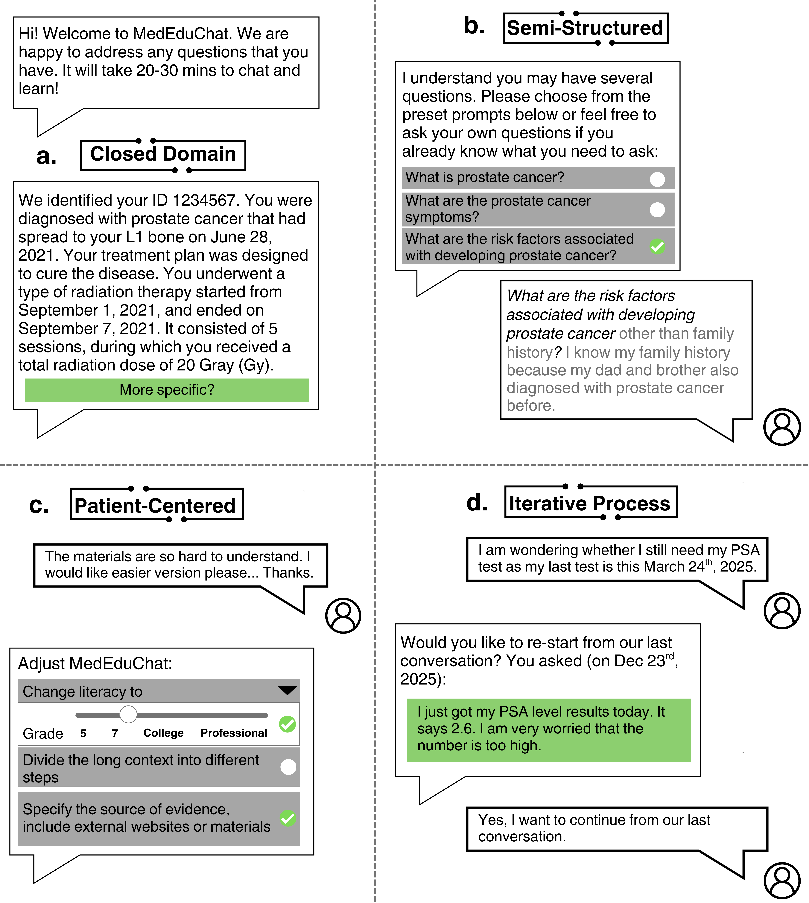

# MedEduChat
MedEduChat is a GPT-4o agent, which integrates with Mayo Clinic’s electronic health records (EHR) system to retrieve information from diverse data sources such as radiotherapy plans, clinical notes, radiology, and pathology reports.

  
   
  <em>Figure 1. Four MedEduChat Main Figures.</em>

This repository contains:

- Prompt configurations defining MedEduChat’s role, scope, and function-calling protocols for structured clinical data retrieval.

- Analysis scripts used to evaluate chat transcripts and clinical professional graders’ assessments across six communication and reasoning dimensions.

# Ethical and Compliance Notice

MedEduChat operates within HIPAA and institutional IRB frameworks. The model accesses Protected Health Information (PHI) exclusively for authorized educational sessions within the Mayo Clinic environment. All usage complies with internal data governance and patient consent protocols.
